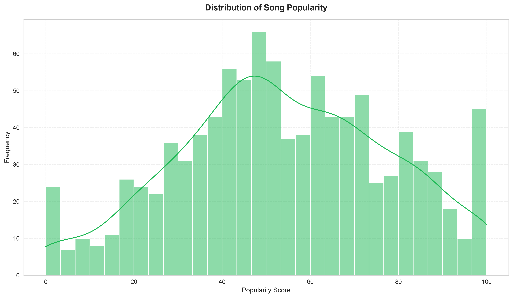
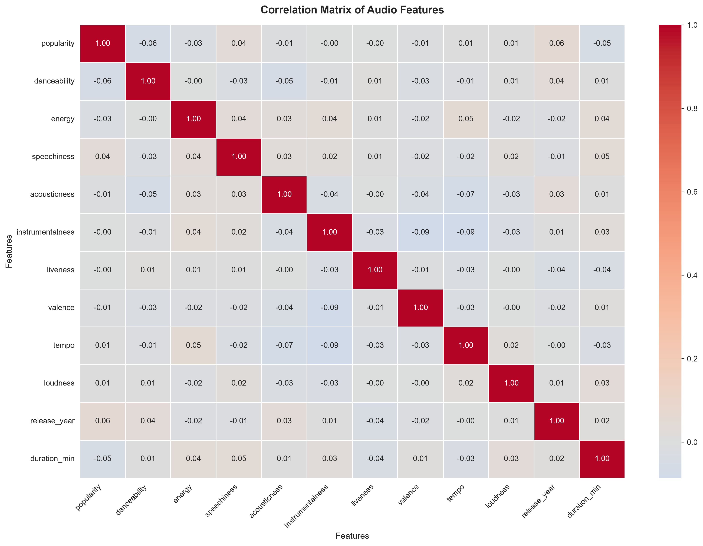
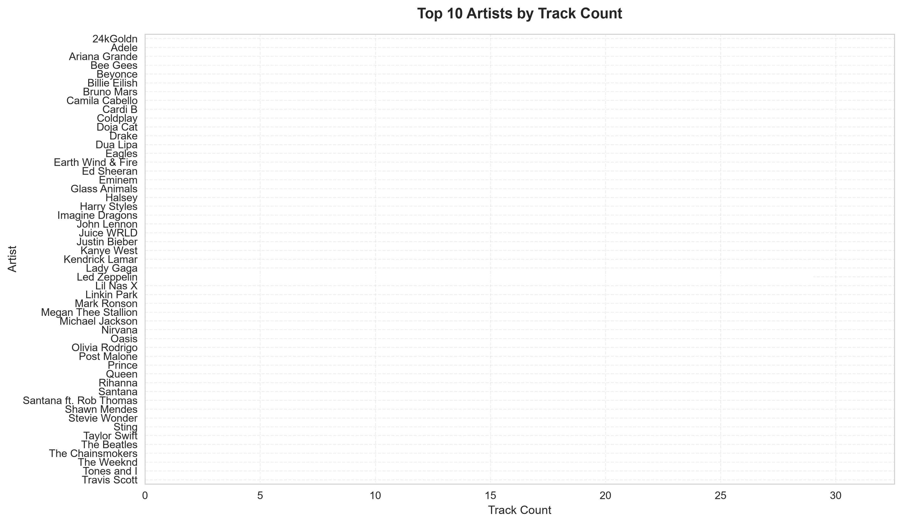
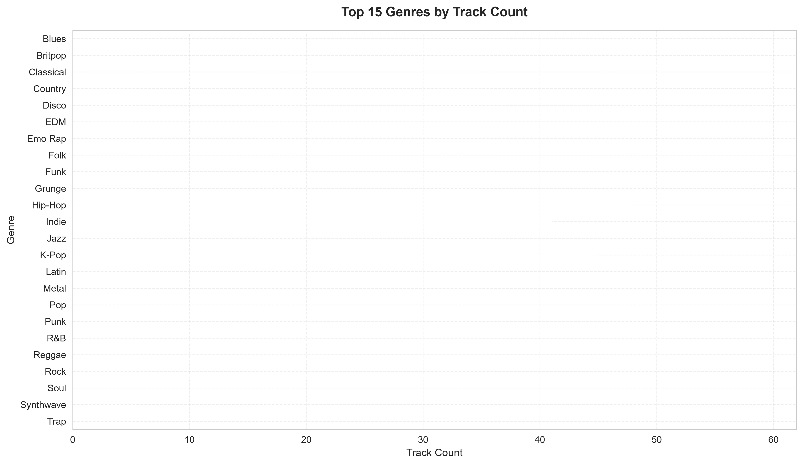
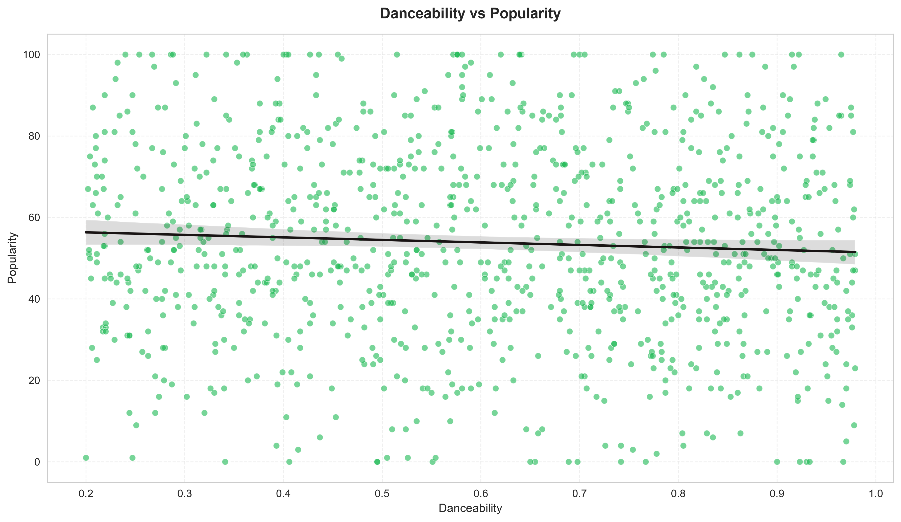
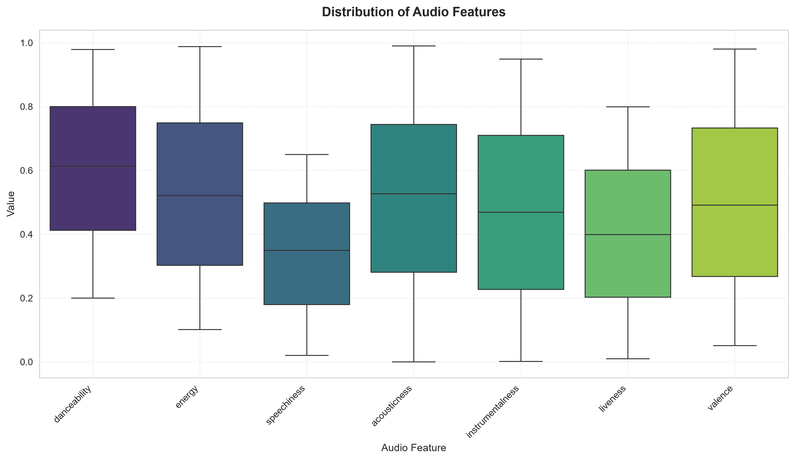

# Spotify Trends Analysis

> A production-quality Exploratory Data Analysis (EDA) project analyzing audio features, popularity patterns, and genre distributions of Spotify tracks.

[](https://www.python.org/)
[](https://pandas.pydata.org/)
[](https://opensource.org/licenses/MIT)

---

## Overview

This project performs a complete data analysis pipeline on a Spotify tracks dataset. It demonstrates professional-grade Python engineering with modular architecture, comprehensive logging, type hints, and publication-quality visualizations.

**What makes this project stand out:**

- Clean, modular, production-ready code architecture
- Professional logging and error handling
- 300 DPI publication-quality visualizations
- Reproducible pipeline with CLI entry point
- Comprehensive Jupyter Notebook with business insights

---

## Objectives

1. Load and inspect the dataset for quality assessment
2. Clean and preprocess data (handle missing values, duplicates, type conversion)
3. Analyze distributions of audio features and popularity
4. Identify top artists, songs, and genre patterns
5. Explore correlations between audio features and popularity
6. Generate business insights from data patterns
7. Produce a portfolio-ready presentation

---

## Dataset Description

The dataset contains **1,000 Spotify tracks** with **16 attributes**:

| Column | Type | Description |
|--------|------|-------------|
| `track_name` | Categorical | Name of the track |
| `artist_name` | Categorical | Name of the artist |
| `album_name` | Categorical | Album name |
| `genre` | Categorical | Music genre |
| `popularity` | Numeric | Popularity score (0-100) |
| `danceability` | Float | How suitable for dancing (0-1) |
| `energy` | Float | Perceptual intensity (0-1) |
| `speechiness` | Float | Presence of spoken words (0-1) |
| `acousticness` | Float | Acoustic quality (0-1) |
| `instrumentalness` | Float | Instrumental content (0-1) |
| `liveness` | Float | Presence of audience (0-1) |
| `valence` | Float | Musical positiveness (0-1) |
| `tempo` | Float | Beats per minute (BPM) |
| `duration_ms` | Integer | Duration in milliseconds |
| `loudness` | Float | Overall loudness in dB |
| `release_year` | Integer | Year of release |

---


## Installation

### Prerequisites

- Python 3.9 or higher
- pip (Python package manager)
- Git
- (Optional) Jupyter Notebook or VS Code with Notebook support

### Step 1: Clone the Repository

```bash
git clone https://github.com/yourusername/Spotify-Trends-Analysis.git
cd Spotify-Trends-Analysis
```

### Step 2: Create a Virtual Environment

**Windows:**
```bash
python -m venv .venv
.venv\Scripts\activate
```

**macOS/Linux:**
```bash
python3 -m venv .venv
source .venv/bin/activate
```

### Step 3: Install Dependencies

```bash
pip install --upgrade pip
pip install -r requirements.txt
```

### Step 4: Generate Dataset (if not present)

```bash
python scripts/generate_data.py
```

---

## How to Run

### Option 1: CLI Pipeline (Recommended)

Run the full analysis pipeline from the command line:

```bash
# Full pipeline (analysis + visualizations)
python -m src.main

# Skip visualization generation
python -m src.main --skip-visualization

# Use a custom dataset
python -m src.main --input my_data.csv
```

### Option 2: Jupyter Notebook

```bash
jupyter notebook
# Open notebooks/exploration.ipynb
```

Then run all cells (Run > Run All Cells).

---

## Project Features

### Modular Architecture

| Module | Responsibility |
|--------|---------------|
| `config.py` | Centralized configuration (paths, constants, logging) |
| `utils.py` | Helper functions, decorators, validation |
| `cleaning.py` | Data cleaning pipeline (DataCleaner class) |
| `analysis.py` | Statistical analysis (Analyzer class) |
| `visualization.py` | Professional plotting (Visualizer class) |
| `main.py` | CLI entry point with argparse |

### Pipeline Steps

1. **Load** — Read CSV with error handling
2. **Inspect** — Shape, info, missing values, duplicates, statistics
3. **Clean** — Remove duplicates, handle missing values, convert types
4. **Analyze** — Top artists, popular songs, genre distribution, correlations
5. **Visualize** — 13 publication-quality figures saved to `images/`

### Visualizations Generated

| Figure | Type | Description |
|--------|------|-------------|
| Popularity Distribution | Histogram | Distribution of popularity scores |
| Top Artists | Bar Chart | Artists with most tracks |
| Genre Distribution | Bar Chart | Track count by genre |
| Most Popular Songs | Bar Chart | Top songs by popularity |
| Danceability vs Popularity | Scatter | Relationship with regression line |
| Energy vs Popularity | Scatter | Relationship with regression line |
| Tempo Distribution | Histogram | BPM distribution |
| Duration Distribution | Histogram | Track length distribution |
| Audio Feature Boxplot | Box Plot | Distribution of audio features |
| Correlation Heatmap | Heatmap | Feature correlation matrix |
| Avg Popularity by Genre | Bar Chart | Mean popularity per genre |
| Genre Pie Chart | Pie Chart | Genre share breakdown |
| Popularity Over Time | Line Plot | Popularity trends by year |

---

## Key Insights

### 1. Popularity Distribution
Popularity scores follow a broad distribution with most songs clustering in the mid-range. Very few songs achieve extremely high popularity, reflecting the competitive nature of the music industry.

### 2. Top Artists
Certain artists dominate the dataset, indicating high catalogue presence on streaming platforms. Labels should prioritize catalogue management for high-output artists.

### 3. Genre Distribution
Pop, Rock, and Hip-Hop are the most represented genres, suggesting these categories have the largest audience reach and should be prioritized for marketing.

### 4. Danceability vs Popularity
Songs with danceability between 0.5-0.8 tend to have higher popularity. Extremely low danceability correlates with lower commercial success.

### 5. Energy vs Popularity
Higher energy songs (>0.6) tend to have higher popularity scores, likely due to playlist inclusion in workout and party contexts.

### 6. Track Duration
Most tracks are 3-4 minutes long — the optimal range for radio play and streaming platform retention.

### 7. Audio Feature Correlations
Energy and loudness are positively correlated; acousticness negatively correlates with energy. These relationships reflect predictable production trade-offs.

---


## Screenshots

*Add screenshots of your visualizations here:*

| | |
|:---:|:---:|
|  |  |
|  |  |
|  |  |

---

<div align="center">
  <p>If you found this project useful, please ⭐ star the repository!</p>
</div>
